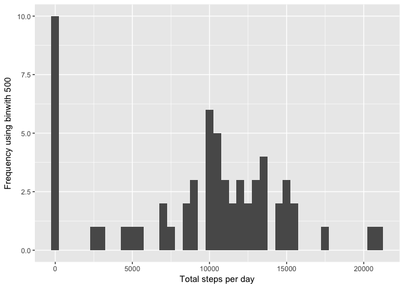
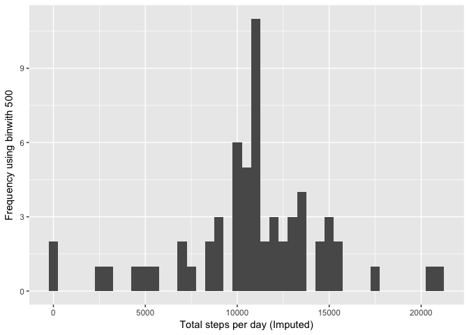
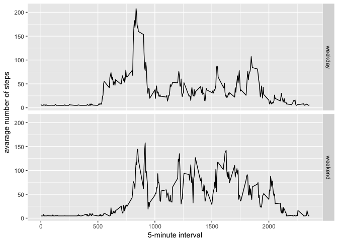

# Reproducible Research: Peer Assessment 1
Razvan Voicu  


### Load the data

```r
if(!file.exists('activity.csv')){
    unzip('activity.zip')
}
data_set <- read.csv('activity.csv')
```

-----

### Mean of the total number of steps taken per day

```r
steps_per_day <- tapply(data_set$steps, data_set$date, sum, na.rm=TRUE)
```

##### 1. Histogram of the total number of steps taken each day

```r
qplot(steps_per_day, xlab='Total steps per day', ylab='Frequency using binwith 500', binwidth=500)
```

<!-- -->

##### 2. Mean and median number of steps per day

```r
steps_per_day_mean <- mean(steps_per_day)
steps_per_day_median <- median(steps_per_day)
```
* Mean: 9354.2295082
* Median:  10395

-----

### Average daily activity pattern

```r
average_steps_per_time_tlock <- aggregate(x=list(meanSteps=data_set$steps), by=list(interval=data_set$interval), FUN=mean, na.rm=TRUE)
```

##### 1. Average step count as a time series plot

```r
ggplot(data=average_steps_per_time_tlock, aes(x=interval, y=meanSteps)) +
    geom_line() +
    xlab("5-minute interval") +
    ylab("average number of steps taken") 
```

<!-- -->

##### 2. Maximum average number of steps per 5-minute interval

```r
max_steps <- which.max(average_steps_per_time_tlock$meanSteps)
time_max_steps <-  gsub("([0-9]{1,2})([0-9]{2})", "\\1:\\2", average_steps_per_time_tlock[max_steps,'interval'])
```

* Most Steps at: 8:35

----

### Impute missing values
##### 1. Total number of missing values in the data_set 

```r
missing_values_count <- length(which(is.na(data_set$steps)))
```

* Number of missing values: 2304

##### 2. New data_set that is equal to the original data_set but with the missing data filled in.

```r
imputed <- data_set
imputed$steps <- impute(data_set$steps, fun=mean)
```


##### 3. Histogram of the total number of steps taken each day 

```r
steps_per_day_imputed <- tapply(imputed$steps, imputed$date, sum)
qplot(steps_per_day_imputed, xlab='Total steps per day (Imputed)', ylab='Frequency using binwith 500', binwidth=500)
```

<!-- -->

##### Mean and median total number of steps taken per day. 

```r
mean_imputed <- mean(steps_per_day_imputed)
median_imputed <- median(steps_per_day_imputed)
```
* Mean (Imputed): 1.0766189\times 10^{4}
* Median (Imputed):  1.0766189\times 10^{4}


----

### Differences in activity patterns between weekdays and weekends
##### 1. Create a new factor variable in the data_set with two levels ??? ???weekday??? and ???weekend??? indicating whether a given date is a weekday or weekend day.


```r
imputed$dateType <-  ifelse(as.POSIXlt(imputed$date)$wday %in% c(0,6), 'weekend', 'weekday')
```

##### 2. Panel plot containing a time series plot


```r
imputed_avg <- aggregate(steps ~ interval + dateType, data=imputed, mean)
ggplot(imputed_avg, aes(interval, steps)) + 
    geom_line() + 
    facet_grid(dateType ~ .) +
    xlab("5-minute interval") + 
    ylab("avarage number of steps")
```

<!-- -->

